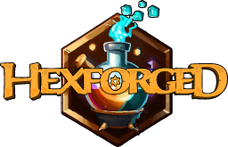



[https://hexforged.com/](https://hexforged.com/)

 &nbsp;  &nbsp;  &nbsp;   

 &nbsp; 

* [About](#about)
* [Roadmap](#roadmap)

## About

Hexforged is an immersive browser-based RPG.

Armed with the extraordinary grimoire called the Hexforge players assume the role of powerful individuals known as the Hexforged.

Join the ranks of the Hexforged, harness the power of the Hexforge, and embark on an endless journey of adventure, magic, and discovery.

## Roadmap

The roadmap is currently a work in progress.
