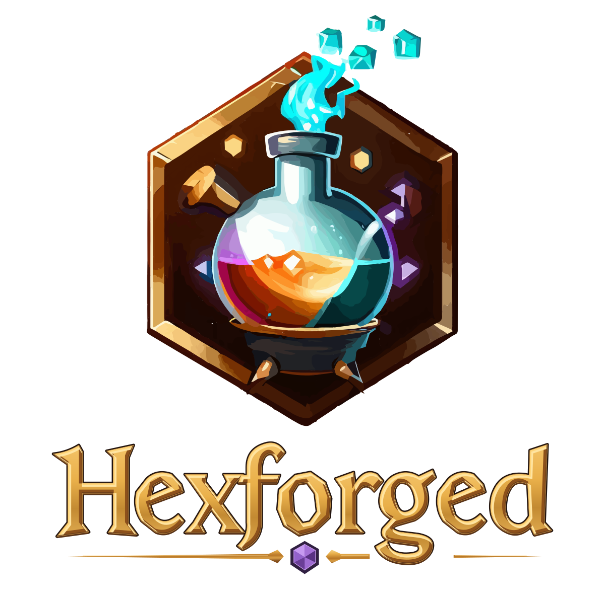

<br/>

[](CODE_OF_CONDUCT.md) &nbsp; [](https://www.conventionalcommits.org/en/v1.0.0/) &nbsp; [](LICENSE) &nbsp; [](https://github.com/zricethezav/gitleaks)  
[](https://semver.org) &nbsp; [](https://discord.gg/DSvUNYm)

## About

The official website for **Hexforged** — a gritty isometric online action RPG
where human world-travelers develop masteries, reshape battlefields, grow
equipment and build persistent strongholds across a universe being consumed
by corruption. The game itself lives at
[hexforged/game](https://github.com/hexforged/game).

The site is a single-page immersive landing experience: a Three.js hex-globe
hero with corruption glow and forge embers, the grimoire, the five masteries,
the worlds, the strongholds, and the road to release.

Built with the [Aurora](https://github.com/kyaulabs/aurora) PHP template
engine (git submodule), Pest for TDD, and the Hexforged Brand Pack v4.

### Requirements

* PHP 8.5+ with Composer
* Node.js 24+ with npm (Three.js vendoring, commitlint)
* `gitleaks` and `commitlint` for the git hooks

### Layout

```
├── aurora/              # kyaulabs/aurora framework (submodule — do not edit)
├── public/              # web docroot
│   ├── index.php        # entry point
│   └── cdn/             # static assets (brand, css, js, vendored three.js)
├── src/                 # Hexforged\Web — palette, content model, page renderer
├── templates/           # Aurora overlay template (head)
├── tests/               # Pest suites (Unit, Feature, arch)
├── AGENTS.md            # operating contract (git flow, identities, TDD, PR flow)
└── CONTEXT.md           # living domain context
```

### Quickstart

```bash
git clone --recurse-submodules git@github.com:hexforged/web.git
cd web
composer install
npm ci
git config core.hooksPath .github/hooks

# serve locally
php -S 127.0.0.1:8080 -t public
```

### Testing

```bash
./vendor/bin/pest --no-coverage
```

Development follows strict TDD (Red → Green → Refactor) — see
[AGENTS.md](AGENTS.md).

### Deployment

Point the web server docroot at `public/`. nginx example:

```nginx
server {
    listen 443 ssl;
    server_name hexforged.com;
    root /var/www/hexforged-web/public;
    index index.php;

    location / { try_files $uri /index.php?$query_string; }

    location ~ \.php$ {
        include fastcgi_params;
        fastcgi_param SCRIPT_FILENAME $document_root$fastcgi_script_name;
        fastcgi_pass unix:/run/php/php-fpm.sock;
    }
}
```

Tagged releases publish a ready-to-deploy tarball (site + Aurora submodule)
on the [releases page](https://github.com/hexforged/web/releases). Run
`composer install --no-dev` on the server after unpacking.

### Contributing

This repository follows **git flow** with hashed branch names
(`feat/kyau-$(openssl rand -hex 3)-<desc>`), **Conventional Commits**
(GPG-signed, atomic, detailed bodies) and a two-account PR flow — the full
contract is documented in [AGENTS.md](AGENTS.md). Domain context lives in
[CONTEXT.md](CONTEXT.md).

### License

[AGPL-3.0-only](LICENSE). Hexforged brand assets remain the property of their
author and are covered by the brand pack usage rules (do not retype, recolor
or distort the logo artwork).
